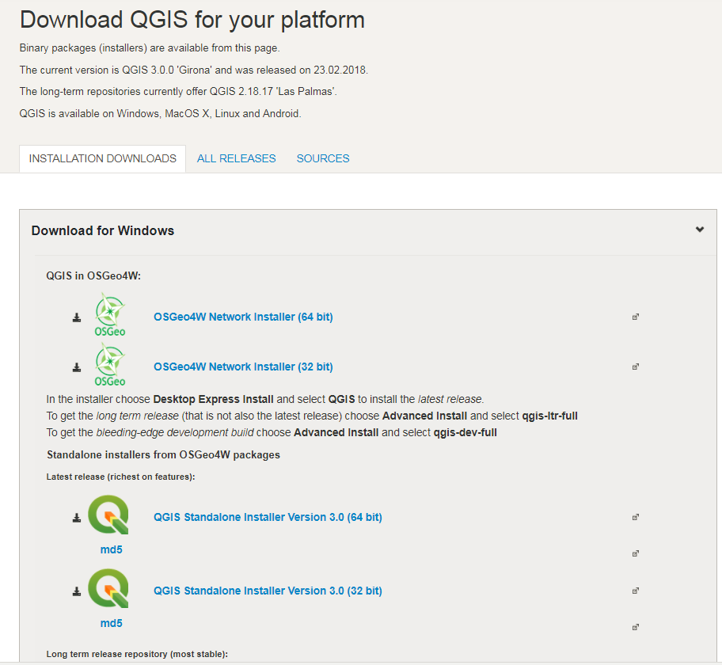
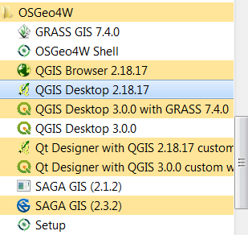
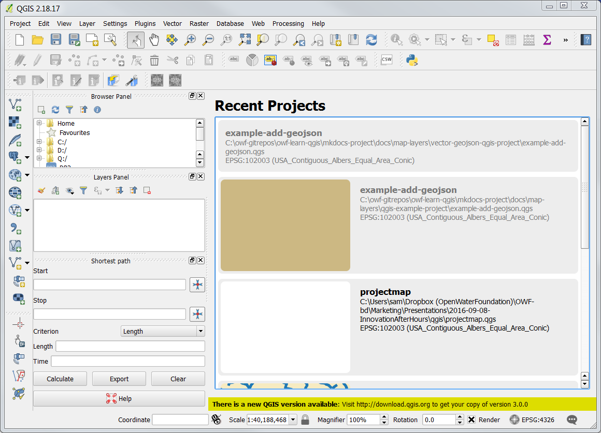

# Learn QGIS / Install QGIS #

Several versions of QGIS software are available for installation, depending on operating system and
historical versions.  It is recommended that for general use the normal OSGeo4 "suite"
is installed, which installs the current QGIS version and optionally allows the stable long-term release to be installed.
QGIS 3.x has been released February 23, 2018.
However, this is a major release and will take some time to become stable across all components.
The stable long-term release (version 2.18.17 or later) can be installed to ensure stability and
flexibility in QGIS 2.x and QGIS 3.x.

* [Download QGIS for your platform](http://www.qgis.org/en/site/forusers/download.html)

The detailed installation below focuses on the ***Advanced Install*** because the Open Water Foundation
uses the long-term release to support the OWF GeoProcessor,
and to ensure that the stable QGIS 2.x version is available.

The following sections are included in this documentation:

* [Download and Install QGIS](#download-and-install-qgis)
* [Run QGIS](#run-qgis)
* [Uninstall QGIS](#uninstall-qgis)
* [Next Steps](#next-steps)

--------------------

## Download and Install QGIS ##

**These instructions were prepared for a Windows 10 64-bit computer, using the QGIS 3.0.0 version.**

It is recommended to install the default "OSGeo4W" suite.
The "standalone" installation approach can be used to install older versions of the software;
however, this is typically only needed in specific cases and should be avoided if possible.

[Download and save the QGIS installer](http://www.qgis.org/en/site/forusers/download.html) for Windows,
selecting ***OsGeo4W Network Installer (64 bit)***, as shown below.

The installer file will have a name similar to `osgeo4w-setup-x86_64.exe`.
The installer program can be run again later to update the software.
Therefore save in a location such as `C:\Users\user\Downloads\QGIS`.
If not saved, the installer can be downloaded again later.

Run the installer with administrator privileges.
The following dialog will be displayed asking how to install QGIS.

The ***Express Desktop Install*** is the simplest install but will install only the current QGIS 3+ version.
Until that version is stable, it is best to do the advanced install and also install the stable long-term release
(QGIS 1.18.17 or later).

Selecting the ***Express Web-GIS Install*** will default installation choices for components
such as the Open MapServer, which is not needed for desktop GIS tasks.
The installer can be run later to install web components if necessary.

Therefore, choose ***Advanced Install***.
The following images illustrate the install process on a Windows 10 computer.
The defaults were accepted unless otherwise noted.

The following step selects the installation folder.
Note that if a standalone installation is done rather than the OSGeo4W suite,
the installation folder will be `C:\Program Files\...`.
Installing for all users saves disk space because a single version of the software is installed.

For the following note that ***OSGeo4W*** will be shown in the ***Start*** menu after the software is installed.
Different versions of QGIS, such as the current 3.0.0 and stable long-term release 2.18.17 (or later)
will be listed under this menu.

For the following, use the default ***Direct Connection*** internet connection setting unless it is
known that another option is required.

For the following, it may be best to select a site that is physically closer.
However, the default can be used until there is a reason to change.
Downloads sites do sometimes go away.

The following allows selecting individual components.
The advanced install is being used to ensure that the long-term release is installed.
Therefore, make sure that the `qgis-ltr` component **does not** have `Skip` next to it.
If so, click on the item to toggle the setting so it will install.
Required dependencies will automatically be selected.
After the installer has been run at least once, the work `Keep` will be shown next to the item.
Other components can also be added if desired.

Clicking ***Next >*** in the above will install the selected components.
A progress indicator will be shown.
The following indicates a successful installation.
Press ***Finish*** to exit the installer.

One or more license acknowledgement requests may be displayed to
fulfill licensing requirements of component software.
The person installing the software just needs to acknowledge that the license notice was read.

## Run QGIS ##

QGIS 2.x is bundled with Python 2.7+ and QGIS 3.x is bundled with Python 3.6+ to
ensure that Python integration performs as intended.
The Windows ***Start*** menu and batch files that run QGIS also indicate the version.
For example, the batch file `qgis.bat` runs the current version (e.g., 3.0.0) and
`qgis-ltr.bat` runs the long-term release (e.g., 2.18.17 or later).

To run QGIS use the ***OSGeo4W*** start menu shown below (example is for Windows 7).
Note that QGIS 3.0.0 is also available, and as updates are installed will become more and more stable
and ready for production use.

Running ***QGIS Desktop 2.18.17*** displays the user interface similar to below.

The ***Help / About*** menu displays the software version information (see below),
which is useful when troubleshooting.

## Uninstall QGIS ##

It may be necessary to uninstall QGIS and then reinstall.

**Need to insert information.**

## Next Steps ##

After installing QGIS it is possible to create a map and add layers to the map.
