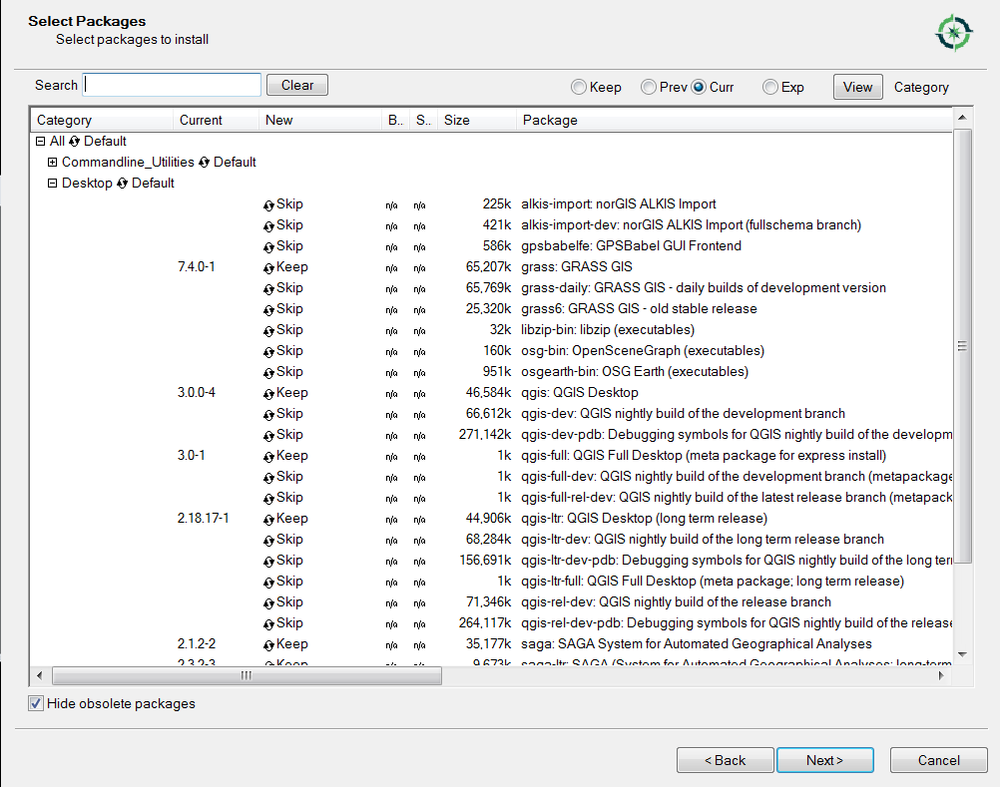

# Learn QGIS / Install QGIS

Several versions of QGIS software are available for installation, depending on operating system and
the features that are needed.

* [Download QGIS for your platform](http://www.qgis.org/en/site/forusers/download.html)

The detailed installation below focuses on QGIS for advanced users, because the Open Water Foundation
uses advanced tools to implement spatial data analysis and visualization tools.
The advanced installer provides options to install desktop and web GIS software components
(desktop is the focus below).

The following sections are included in this documentation:

* [Download and Install QGIS for Advanced Users](#download-and-install-qgis-for-advanced-users)
* [Run QGIS](#run-qgis)
* [Next Steps](#next-steps)

## Download and Install QGIS for Advanced Users

**These instructions were prepared for a Windows 10 64-bit computer.**

QGIS is bundled with Python 2.7 to ensure that Python integration performs as intended.

Download and install [QGIS for Advanced Users](http://www.qgis.org/en/site/forusers/download.html) for Windows,
selecting ***OsGeo4W Network Installer (64 bit)*** for Windows 7 or 10 machine.

Run the installer with administrator privileges, which will have a name similar to `osgeo4w-setup-x86_64.exe`.

As instructed on the website, choose ***Desktop Express Install*** and select QGIS to install the latest release.
Selecting the ***Express Web-GIS Install*** will instead install components such as the Open MapServer,
which is not needed for desktop GIS tasks (can be run later to install web components).

The following images illustrate the install process on a Windows 10 computer.  All of the defaults were accepted.

## Run QGIS

To run QGIS use the ***OSGeo4W*** start menu shown below:

Running ***QGIS Desktop 2.18.1*** displays the user interface similar to below:

The ***Help / About*** menu displays the software version information, which is useful when troubleshooting:

## Next Steps

After installing QGIS it is possible to create a map and add layers to the map.
