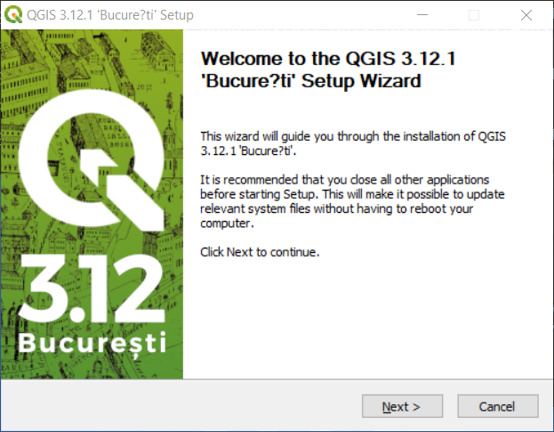
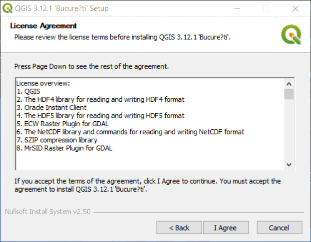
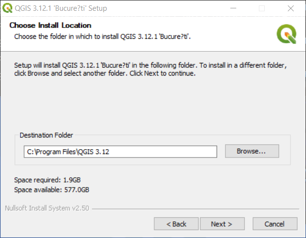
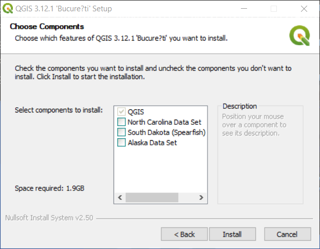
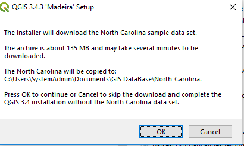
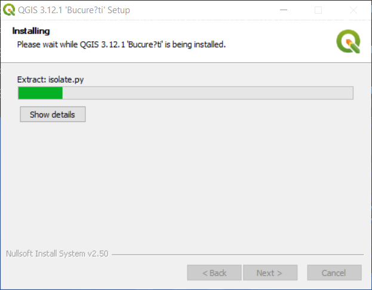
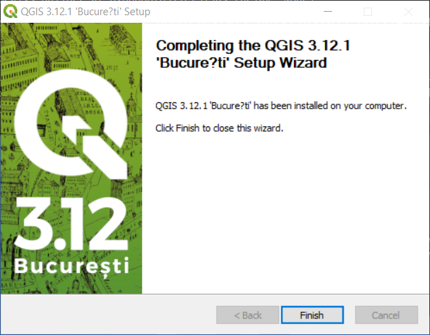

# QGIS / Install QGIS

**These instructions were created for QGIS standalone 3.12 installed on a Windows 10 computer.**

See also [the latest instructions](../install-qgis.md).

##  Installing Standalone QGIS 3.12 on Windows ###

See the [QGIS download page](https://www.qgis.org/en/site/forusers/download.html)
for QGIS standalone installer version.
Select a suitable standalone latest or long term release,
such as **QGIS Standalone Installer Version 3.12 (64-bit)** for Windows 10.
The file will have a name similar to the following:

```
QGIS-OSGeo4W-3.12.1-1-Setup-x86_64.exe
```

After downloading, run the installer and follow installation steps as described below.
The installer may prompt for administrator credentials.

The QGIS standalone installer installs QGIS in `C:\Program Files\QGIS 3.12` (or similar) and
after installation can be run from the ***Start / QGIS 3.12*** menu.
The following dialog is displayed at the start of the installation process:

**<p style="text-align: center;">

</p>**

Press ***Next>*** to continue.  One or more license agreements may be displayed, as shown below.

**<p style="text-align: center;">

</p>**

Press ***I Agree*** to continue.
The following dialog will be shown to select the software installation location.

**<p style="text-align: center;">

</p>**

The default installation folder should typically be used.
If it is necessary to use a different drive, then it is recommended to use the same folder on the second drive,
for example `E:\Program Files\QGIS 3.12`.
This will allow other tools such as custom applications to more easily find the software.
Press ***Next >*** to continue.

**<p style="text-align: center;">

</p>**

The above optional datasets are distributed for testing and can be selected if desired.
However, it is typically easier to work with data for an area of interest.
Press ***Install*** to install the software.

If datasets were selected, a dialog similar to the following will be shown indicating where the data files are installed.
Note that there is an issue that if the QGIS installer is run as administrator,
the data files are installed under the administrator account rather than the normal user.
Sometimes trying to install the datasets results in errors for unknown reasons.
Experience at the Open Water Foundation is that the datasets should be avoided.

**<p style="text-align: center;">

</p>**

The following progress dialog will be displayed during installation.

**<p style="text-align: center;">

</p>**

The following indicates a successful installation.

**<p style="text-align: center;">

</p>**

Press ***Finish*** to exit the installer.
