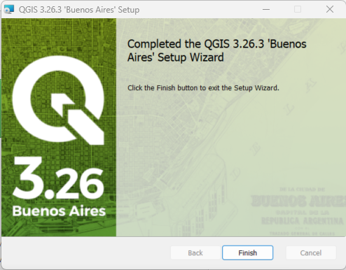

# QGIS / Install QGIS #

This page describes how to select a QGIS version and install, update,
run (to confirm install), and uninstall the software.
The Open Water Foundation's primary development platform is Windows 10, although Cygwin and Linux are also used.
Consequently, information on this page is more complete and current for Windows 10,
and the other sections will be filled in as experience is gained.

* [Selecting a QGIS Version](#selecting-a-qgis-version)
	+ [Selecting a QGIS Version on Cygwin](#selecting-a-qgis-version-on-cygwin)
	+ [Selecting a QGIS Version on Linux](#selecting-a-qgis-version-on-linux)
	+ [Selecting a QGIS Version on Windows](#selecting-a-qgis-version-on-windows)
* [Installing QGIS](#installing-qgis)
	+ [Installing QGIS on Cygwin](#installing-qgis-on-cygwin)
	+ [Installing QGIS on Linux](#installing-qgis-on-linux)
	+ [Installing QGIS on Windows](#installing-qgis-on-windows)
		- [Installing Standalone QGIS on Windows](#installing-standalone-qgis-on-windows)
		- [Installing OSGeo4W QGIS on Windows](#installing-osgeo4w-qgis-on-windows)
* [Running QGIS](#running-qgis)
	+ [Running QGIS on Cygwin](#running-qgis-on-cygwin)
	+ [Running QGIS on Linux](#running-qgis-on-linux)
	+ [Running QGIS on Windows](#running-qgis-on-windows)
		- [Running Standalone QGIS on Windows](#running-standalone-qgis-on-windows)
		- [Running OSGeo4W QGIS on Windows](#running-osgeo4w-qgis-on-windows)
* [Updating QGIS](#updating-qgis)
	+ [Updating QGIS on Cygwin](#updating-qgis-on-cygwin)
	+ [Updating QGIS on Linux](#updating-qgis-on-linux)
	+ [Updating QGIS on Windows](#updating-qgis-on-windows)
		- [Updating Standalone QGIS on Windows](#updating-standalone-qgis-on-windows)
		- [Updating OSGeo4W QGIS on Windows](#updating-osgeo4w-qgis-on-windows)
* [Uninstalling QGIS](#uninstalling-qgis)
	+ [Uninstalling QGIS on Cygwin](#uninstalling-qgis-on-cygwin)
	+ [Uninstalling QGIS on Linux](#uninstalling-qgis-on-linux)
	+ [Uninstalling QGIS on Windows](#uninstalling-qgis-on-windows)
		+ [Uninstalling standalone QGIS on Windows](#uninstalling-standalone-qgis-on-windows)
		+ [Uninstalling OSGeo4W QGIS on Windows](#uninstalling-osgeo4w-qgis-on-windows)

---

## Selecting a QGIS Version ##

This section provides information about selecting a QGIS version.
The terms "installation type", "product", "variant", "version", and "release" are used somewhat interchangeably.
Effort has been taken to provide other information such as "OSGeo4W", "standalone", and version number to minimize confusion.
See also more detail in subsections for each operating system:

* [Selecting a QGIS Version on Cygwin](#selecting-a-qgis-version-on-cygwin)
* [Selecting a QGIS Version on Linux](#selecting-a-qgis-version-on-linux)
* [Selecting a QGIS Version on Windows](#selecting-a-qgis-version-on-windows)

Several QGIS software product variants are available for installation,
and it may not be obvious which version to use.
Below are recommendations based on experience at the Open Water Foundation.

The [QGIS download page for users](https://qgis.org/en/site/forusers/download.html)
is similar to the following image and lists QGIS software installers.
The image has been annotated to point out useful information.

**<p style="text-align: center;">

</p>**

**<p style="text-align: center;">
QGIS Download Page (<a href="../images/qgis-download-page.png">see full-size image</a>)
</p>**

The current QGIS version is listed in the upper left.
Mousing over standalone QGIS download links will display the more detailed version in the installer filename.
The  OSGeo4W setup program name does not indicate versions because the latest installed version
exists on the system, as discussed more below.

Lacking information, it is logical to attempt installing the first product listed on the page.
However, this may not be ideal and choosing a product wisely can avoid issues later.
One consideration is that different operating systems provide different options for installing multiple versions of the QGIS software.
For example, on Linux, software typically installs into shared systems folders that any user can access.
However, as a software developer, it may be important to install multiple versions (perhaps in a user's filespace rather than system files)
and be able to test with each version.  This may be more or less difficult depending on operating system and product variant.
Certainly, the use of personal virtual machines makes it possible for a Linux user to have great flexibility on that machine,
but protocols adopted for one user may not transfer to multi-user systems.

The following table summarizes key aspects of each installer type.
Ideally, it should be possible to use default installation options
so that other tools can find software in standard locations,
and custom installations may confuse the installed software.

**<p style="text-align: center;">
QGIS Installer Types
</p>**

| **Installation Type** | **Default Install Folder**&nbsp;&nbsp;&nbsp;&nbsp;&nbsp;&nbsp;&nbsp;&nbsp;&nbsp;&nbsp;&nbsp;&nbsp;&nbsp;&nbsp;&nbsp;&nbsp;&nbsp;&nbsp;&nbsp;&nbsp;&nbsp;&nbsp;&nbsp;&nbsp;&nbsp;&nbsp;&nbsp;&nbsp;&nbsp;&nbsp;&nbsp;&nbsp;&nbsp;&nbsp;&nbsp;&nbsp;&nbsp;&nbsp;&nbsp;&nbsp;&nbsp;&nbsp;&nbsp;&nbsp;&nbsp;&nbsp;&nbsp;&nbsp;&nbsp;&nbsp;&nbsp;| **Comments** |
| -- | -- | -- |
| **OSGeo4W** | `C:\OSGeo4W64` | This product is a general "OSGeo4W" (open source geo for windows) version that optionally includes many tools including QGIS, GeoServer, and OpenLayers (not just QGIS) and supports a broader set of uses.  The default installation configuration does not install into a versioned folder, which makes it more difficult to work with multiple verisions.  This is one reason why the Open Water Foundation typically uses the standalone installation.  The OSGeo4W network installer uses installation tools similar to Cygwin.  |
| **Standalone Latest Release** | `C:\Program Files\QGIS 3.12` (only x.x is used in the folder name, not x.x.x) | This product focuses on QGIS and related supporting software such as PyQGIS, GDAL, and OGR.  This version is the latest release, which contains the latest features.  The latest version may may require updates as bugs are fixed and new features are modified, resulting in x.x.X version number.  Because the version is indicated in the installation folder, multiple versions can exist on the computer, which is important when supporting applications that depend on a version.  A standalone version that has been installed as the latest version uses `C:\Program Files\QGIS 3.12\apps\qgis\python`, which is specified in the Python `PYTHONPATH` for applications (see also Long Term Release below).  The installer is similar to other Windows software installers (choose components, install folder, etc.). |
| **Standalone Long term release (LTR)** | Same convention as latest release | The QGIS LTR releases are similar to standalone versions except that they are a snapshot of older versions and the splash screen when starting QGIS indicates that the version is a long term release.  Older versions typically receive less attention by the developer community unless the version is important for an application.  LTR versions use `C:\Program Files\QGIS 3.12\apps\qgis-ltr\python`, which is specified in the Python `PYTHONPATH` for applications. |

It is possible to have multiple standalone "latest" releases installed at the same time.
For example, standalone QGIS 3.10 may have been installed at a point in time when it was the latest release.
Later, standalone QGIS 3.12 may have been installed at a point in time when it was the latest release.
If desired, a previously-installed standalone version can be updated once it is released as a long term release
(See the [Updating QGIS](#updating-qgis) section).

Applications such as Python applications that are developed with a specific QGIS version should
check the installed QGIS version to ensure compatibility,
and deal with the difference in `apps\qgis\python` and `apps\qgis-ltr\python` folders.

###  Selecting a QGIS Version on Cygwin ###

Running QGIS in a Cygwin environment can leverage QGIS for Windows.
See the [Selecting a QGIS Version on Windows](#selecting-a-qgis-version-on-windows) section.
Automation can occur using typical Cygwin folder names (`/cygdrive/...`) and command line programs.

###  Selecting a QGIS Version on Linux ###

This section is incomplete.  See the discussion for Windows to gain insight about Linux QGIS versions.

###  Selecting a QGIS Version on Windows ###

The Windows QGIS product variations (OSGeo4W, standalone) can typically be installed at the same time,
resulting in the ***Start*** menu on Windows listing multiple installation types and versions, as in the following menu image.
In this case, two versions of standalone QGIS have been installed,
corresponding to menus ***QGIS 3.4*** and ***QGIS 3.10***, each with submenus for software distributed with QGIS.
The third component of the version is indicated in the menu item and running the software will display "long term release"
in the splash screen if the release is a long term release.

Additionally, OSGeo4W QGIS has been installed, corresponding to menu ***QGIS3*** (only major version is shown in the menu).
The standalone versions each provide multiple sub-menus for programs related to QGIS,
whereas the OSGeo4W ***QGIS3*** menu is equivalent running ***QGIS Desktop*** in the standalone version,
but of course runs the software installed with OSGeo4W installation (see below).

**<p style="text-align: center;">

</p>**

**<p style="text-align: center;">
Windows Start Menu Showing GQIS Versions (<a href="../images/win-start-qgis-menu.png">see full-size image</a>)
</p>**

Installing OSGeo4W QGIS also adds the ***Start / OSGeo4W*** menu as shown below,
with menu items for software that was installed.
Software versions reflect those in the general OSGeo4W installation (in this case not all OSGeo4W software products were installed).

**<p style="text-align: center;">

</p>**

**<p style="text-align: center;">
Windows Start Menu Showing OSGeo4W Software (<a href="../images/win-start-osgeo4w-menu.png">see full-size image</a>)
</p>**

It can be confusing to know which version of QGIS software will be run when a menu is selected,
in particular for OSGeo4W installation.
To find more information, right-click on the menu item (for example for ***Start / QGIS3***)
and then select ***More*** and ***Open file location***.
This will typically show a shortcut to another file, indicated by the arrow on the icon and ***shortcut*** file type, for example:

**<p style="text-align: center;">

</p>**

Right click on the ***QGIS3*** shortcut and select ***Properties*** to view the file system location of the software.
As shown below, this indicates that the OSGeo4W64 QGIS software (64-bit) is installed in the default OSGeo4W installation location
(`C:\OSGeo4W64`).
The software must be run to determine its version because the detailed
version is not included in any folder in the installation path.

**<p style="text-align: center;">

</p>**

**<p style="text-align: center;">
QGIS3 Shortcut Properties Showing File Location (<a href="../images/win-qgis3-properties.png">see full-size image</a>)
</p>**

------------
 
## Installing QGIS ##

Installing QGIS the first time should consider the different installer types.
See the [Selecting a QGIS Version](#selecting-a-qgis-version) section for information about selecting
a QGIS version to install.
Subsequent QGIS installations will typically use the same installer type as previous and may need to
consider if multiple versions should be installed at the same time,
for example to allow using an older version if new version does not work as expected.
See details in subsections for each operating system:

+ [Installing QGIS on Cygwin](#installing-qgis-on-cygwin)
+ [Installing QGIS on Linux](#installing-qgis-on-linux)
+ [Installing QGIS on Windows](#installing-qgis-on-windows)
	- [Installing Standalone QGIS on Windows](#installing-standalone-qgis-on-windows)
	- [Installing OSGeo4W QGIS on Windows](#installing-osgeo4w-qgis-on-windows)

##  Installing QGIS on Cygwin ##

These instructions currently do not cover installing QGIS for Cygwin.
The best approach may be to install QGIS on Windows and then create shell scripts in Cygwin
to run the Windows version.

##  Installing QGIS on Linux ##

This section is incomplete.  Download and run the Linux installer available on the [QGIS downloads page](https://qgis.org/en/site/forusers/download.html).

##  Installing QGIS on Windows ##

The QGIS installation process on Windows depends on whether the standalone or OSGeo4W install is being installed.

###  Installing Standalone QGIS on Windows ###

**These instructions were created for QGIS standalone 3.12 installed on Windows 10 computer.**

See the [QGIS download page](https://www.qgis.org/en/site/forusers/download.html)
for QGIS standalone installer version.
Select a suitable standalone latest or long term release,
such as **QGIS Standalone Installer Version 3.12 (64-bit)** for Windows 10.
The file will have a name similar to the following:

```
QGIS-OSGeo4W-3.12.1-1-Setup-x86_64.exe
```

After downloading, run the installer and follow installation steps as described below.
The installer may prompt for administrator credentials.

The QGIS standalone installer installs QGIS in `C:\Program Files\QGIS 3.12` (or similar) and
after installation can be run from the ***Start / QGIS 3.12*** menu.
The following dialog is displayed at the start of the installation process:

**<p style="text-align: center;">

</p>**

Press ***Next>*** to continue.  One or more license agreements may be displayed, as shown below.

**<p style="text-align: center;">

</p>**

Press ***I Agree*** to continue.
The following dialog will be shown to select the software installation location.

**<p style="text-align: center;">

</p>**

The default installation folder should typically be used.
If it is necessary to use a different drive, then it is recommended to use the same folder on the second drive,
for example `E:\Program Files\QGIS 3.12`.
This will allow other tools such as custom applications to more easily find the software.
Press ***Next >*** to continue.

**<p style="text-align: center;">

</p>**

The above optional datasets are distributed for testing and can be selected if desired.
However, it is typically easier to work with data for an area of interest.
Press ***Install*** to install the software.

If datasets were selected, a dialog similar to the following will be shown indicating where the data files are installed.
Note that there is an issue that if the QGIS installer is run as administrator,
the data files are installed under the administrator account rather than the normal user.
Sometimes trying to install the datasets results in errors for unknown reasons.
Experience at the Open Water Foundation is that the datasets should be avoided.

**<p style="text-align: center;">

</p>**

The following progress dialog will be displayed during installation.

**<p style="text-align: center;">

</p>**

The following indicates a successful installation.

**<p style="text-align: center;">

</p>**

Press ***Finish*** to exit the installer.
See the [Running QGIS on Windows](#running-qgis-on-windows) section for instructions for how to run standalone QGIS.

###  Installing OSGeo4W QGIS on Windows ###

**This documentation is out of date.
The Open Water Foundation recommends installing a standalone QGIS version if possible because the
process is simpler and multiple versions of QGIS can be installed.**

The OSGeo4W stable long-term release (version 2.18.17 or later) can be installed with QGIS 3 if older QGIS 2 software is needed.
However, now that QGIS 3 has matured, QGIS 2 is less likely to be needed unless another application depends on it.
This documentation focuses on the latest QGIS 3 version, with sections for the standalone and OSGeo4W versions.

Use the following link to install download QGIS:

* [Download QGIS for your platform](http://www.qgis.org/en/site/forusers/download.html)

The detailed OSGeo4W installation below focuses on the ***Express Install***, which is sufficient for most users.
The ***Advanced Install*** section is also discussed because the Open Water Foundation
used the long-term release available in the advanced install during development of early
versions of the OWF GeoProcessor software and the documentation may be useful.


**This version can be installed rather than or in addition to the Standalone QGIS installation.
the OSGeo4W installation uses non-versioned folder and therefore only one version can be installed unless
additional actions are taken.**

**These instructions were prepared for a Windows 10 64-bit computer, using the OSGeo4W QGIS 3.4.3 Madeira version.**

Before installing/updating QGIS:

* **If there are issues installing the software, try uninstalling the software and then installing again.**
* If updating QGIS, it is recommended to uninstall the previous version and unfortunately this may involve some manual steps.
See the [Uninstall OSGeo4W QGIS](#uninstall-osgeo4w-qgis) section.
* See the [Windows OSGeo4W Troubleshooting Install](#windows-osgeo4w-troubleshooting-install) section for more information about troubleshooting software once installed.

It is recommended to install the default "OSGeo4W" suite.
The ***OSGeo4W Network Installer*** provides defaults and the flexibility to install additional software components,
which may be needed, such as when working with map servers.
In this version, QGIS has been bundled into the OSGeo4W suite.
The ***QGIS Standalone Installer Version*** can also be installed for normal desktop GIS and provides QGIS and GRASS (raster processing) software.
The first of these options will result in files being installed in `C:\OSGeo4W64`,
whereas the second option will install into `C:\Program Files\...`.
Note that the [Open Water Foundation GeoProcessor software](http://learn.openwaterfoundation.org/owf-app-geoprocessor-python-doc-user/)
installation currently will use the standalone installation if found on a computer
before trying to use the `C:\OSGeo4W64` installation version.

The ***Express Install*** approach is recommended to install the latest software.
The ***Advanced Install*** approach can be used to install older versions of the software including QGIS 2.x long term release (old LTR);
however, this is typically only needed in specific cases and should be avoided if possible.
Downloading and installing QGIS will overwrite the previous version that is installed.
Installing multiple versions of QGIS is not described in this documentation but maybe be added in the future.

[Download and save the QGIS installer](http://www.qgis.org/en/site/forusers/download.html) for Windows,
selecting ***OsGeo4W Network Installer (64 bit)***, as shown below.

**<p style="text-align: center;">

</p>**

The installer file will have a name similar to `osgeo4w-setup-x86_64.exe` and is not specific to the QGIS version number.
The installer program can be run again later to update the software.
Therefore save in a location such as `C:\Users\user\Downloads\QGIS`.
If not saved, the installer can be downloaded again later.

**Run the installer with administrator privileges**.
The following dialog will be displayed asking how to install QGIS.

**<p style="text-align: center;">

</p>**

### Windows OSGeo4W Express Desktop Install ###

The ***Express Desktop Install*** is the simplest install and will install only the current QGIS 3+ version (no 2.x long term release).
Selecting the ***Express Web-GIS Install*** will default installation choices for components
such as the Open MapServer, which is not needed for desktop GIS tasks.
The installer can be run later to install web components if necessary. 
The following images illustrate the install process on a Windows 10 computer. 
The defaults were accepted unless otherwise noted.

Select ***Express Desktop Install*** on the inital setup window.

**<p style="text-align: center;">

</p>**

The following step selects the packages to download. 
[GDAL](http://www.gdal.org/) and [GRASS GIS](https://grass.osgeo.org/) software programs are commonly packaged libraries used within the QGIS software. 
It is highly recommended to use the default settings. 
If running the first time, you may be prompted to select a download server.

**<p style="text-align: center;">

</p>**

Agree to the terms of use for all components, similar to the following.

**<p style="text-align: center;">

</p>**

The install will begin.  It may take some time for the installation to complete given that a large number of packages are installed.

**<p style="text-align: center;">

</p>**

A message window appears once the installation is complete. 

**<p style="text-align: center;">

</p>**

After installation, the software is listed in the ***Start / QGIS3*** menu and the
***Start / OSGeo4W*** menu provides access to other GIS software.
The OSGeo4W version of QGIS is installed in the `C:\OSGeo4W64` folder.

Note that the above menus are different than the ***Start / QGIS 3.4*** menu,
which is created by the standalone QGIS installer.

### Windows OSGeo4W Advanced Install ###

The ***Advanced Install*** will install QGIS 3 and is required if it is necessary to run the older QGIS 2.x software, which used Python 2.
This following instructions are retained in this documentation for reference.
However, it is recommended to use the latest QGIS 3 installer described in the previous section if possible.
The following images illustrate the install process on a Windows 10 computer.
The defaults were accepted unless otherwise noted.

Select ***Advanced Install*** on the initial setup window.

**<p style="text-align: center;">

</p>**

**<p style="text-align: center;">

</p>**

The following step selects the installation folder.
Note that if a standalone installation is done rather than the OSGeo4W suite,
the installation folder will be `C:\Program Files\...`.
Installing for all users saves disk space because a single version of the software is installed.

**<p style="text-align: center;">

</p>**

For the following note that ***OSGeo4W*** will be shown in the ***Start*** menu after the software is installed.
Different versions of QGIS, such as the current 3.0.0 and stable long-term release 2.18.17 (or later)
will be listed under this menu.

**<p style="text-align: center;">

</p>**

For the following, use the default ***Direct Connection*** internet connection setting unless it is
known that another option is required.

**<p style="text-align: center;">

</p>**

For the following, it may be best to select a site that is physically closer.
However, the default can be used until there is a reason to change.
Downloads sites do sometimes go away.

**<p style="text-align: center;">

</p>**

The following allows selecting individual components.
The advanced install is being used to ensure that the long-term release is installed.
Therefore, make sure that the `qgis-ltr` component **does not** have `Skip` next to it.
If so, click on the item to toggle the setting so it will install.
Required dependencies will automatically be selected.
After the installer has been run at least once, the work `Keep` will be shown next to the item.
Other components can also be added if desired.

**<p style="text-align: center;">

</p>**

Clicking ***Next >*** in the above will install the selected components.
A progress indicator will be shown.
The following indicates a successful installation.
Press ***Finish*** to exit the installer.

One or more license acknowledgement requests may be displayed to
fulfill licensing requirements of component software.
The person installing the software just needs to acknowledge that the license notice was read.

### Windows OSGeo4W Troubleshooting Install ###

The following information may be helpful when troublehshooting a QGIS installation or update:

* **After update, scripts that run QGIS still find the old software**.  
If an update has occurred, the previous version may have been copied to a new folder.
For example `C:\OSGeo4W64` may have been copied to `C:\OSGeo4W64-old`.
The underlying scripts that run QGIS use old-style 8.3 filenames,
which results in using a folder name `C:\OSGEO4~1`.
Renaming the folder as shown above still matches the old convention.
Therefore, the old folder is found and is run.
To fix, rename the old installation to `C:\x-OSGeo4W64` or similar so that the filename is
different enough to change the old-style name.

-------------

## Running QGIS ##

This section provides information about running QGIS,
at least to start the software to make sure that the installation process was successful.
See also more detail in subsections for each operating system:

+ [Running QGIS on Cygwin](#running-qgis-on-cygwin)
+ [Running QGIS on Linux](#running-qgis-on-linux)
+ [Running QGIS on Windows](#running-qgis-on-windows)
	- [Running Standalone QGIS on Windows](#running-standalone-qgis-on-windows)
	- [Running OSGeo4w QGIS on Windows](#running-osgeo4w-qgis-on-windows)

QGIS software is typically run from the desktop menu for each operating system.
However, programs can also be run from the command line.
This documentation focuses on running from menus rather than command line,
although command line information is provided where experience has been gained.

##  Running QGIS on Cygwin ##

This section is incomplete.  Refer to the 
[Running QGIS on Windows](#running-qgis-on-windows) section for related information.

##  Running QGIS on Linux ##

This section is incomplete.

##  Running QGIS on Windows ##

Running QGIS on Windows depends on whether the standalone or OSGeo4W install was used.

###  Running Standalone QGIS on Windows ###

After installing, the software is installed in `C:\Program Files\QGIS 3.12` (or similar).
The ***Start / QGIS 3.12*** menu (or similar) provides access to the specific version of QGIS
and related software.  To run desktop QGIS, select ***Start / QGIS 3.12 / QGIS Desktop 3.12.1*** (or similar).

If the OSGeo4W version has also been installed,
the ***Start / QGIS3*** menu will exist and will point to software in the `C:\OSGeo4W64` folder (see the
[next section](#running-osgeo4w-qgis-on-windows)).

###  Running OSGeo4w QGIS on Windows ###

OSGeo4W QGIS 3.x is bundled with both Python 2.7+ and Python 3.6 (or newer) and uses Python 3.6 (or newer) for start-up and processing. 
QGIS can be started with the Windows ***Start*** menu or with the installed batch files. 

- To run QGIS with the Windows ***Start*** menu, use the ***OSGeo4W*** start menu shown below (example is for Windows 10 Pro). 
Click the `QGIS Desktop 3.X.X` option.
If the long-term release QGIS version was installed with the [OSGeo4W Advanced Install](#windows-osgeo4w-advanced-install) 
then `QGIS Desktop 2.X.X` or other old version may also be available in the ***OSGeo4W*** dropdown menu. 

**<p style="text-align: center;">

</p>**

- To run QGIS with the batch file, double-click the `qgis.bat` file at `C:\OSGeo4W64\bin\qgis.bat`.
If the long-term release QGIS version was installed with the [OSGeo4W Advanced Install](#windows-osgeo4w-advanced-install)
then start with the `qgis-ltr.bat` file at `C:\OSGeo4W64\bin\qgis-ltr.bat`. 

Running ***QGIS Desktop 3.0.3*** displays the user interface similar to below. 

**<p style="text-align: center;">

</p>**

The ***Help / About*** menu displays the software version information (see below),
which is useful when troubleshooting.

**<p style="text-align: center;">

</p>**

---------

## Updating QGIS ##

QGIS software typically needs to be updated in the following cases:

* A maintenance release fixes bugs or provides a useful new feature.
For example QGIS version 3.12.2 is released and updates previously installed 3.12.1.
* A version that was previously installed as the current release needs to be updated to be the long-term release.
This has the side-effect that (on Windows) the `C:\Program Files\QGIS 3.12\apps\qgis-ltr\python` folder is used for long-term release
rather than `C:\Program Files\QGIS 3.12\apps\qgis\python` folder that is used for latest release.
Python tools should therefore check for the `qgis-ltr` folder as well as `qgis` in order to
always find necessary files for `PYTHONPATH`.

The version number for running QGIS software can be determined by using the ***Help / About*** menu.
The version for standalone QGIS should agree with the installation folder and ***Start / QGIS N.N*** menu.
The version for OSGeo4W installation must be determined using the ***Help / About*** menu.

Performing an update may cause the old version to be uninstalled and the new version to install.
Therefore, additional installation steps may be required after an update,
for example if additional Python packages need to be reinstalled.

See details in subsections for each operating system:

+ [Updating QGIS on Cygwin](#updating-qgis-on-cygwin)
+ [Updating QGIS on Linux](#updating-qgis-on-linux)
+ [Updating QGIS on Windows](#updating-qgis-on-windows)
	- [Updating Standalone QGIS on Windows](#updating-standalone-qgis-on-windows)
	- [Updating OSGeo4W QGIS on Windows](#updating-osgeo4w-qgis-on-windows)

##  Updating QGIS on Cygwin ##

This documentation is incomplete.  The Windows QGIS version can be used with Cygwin.

##  Updating QGIS on Linux ##

This documentation is incomplete.

##  Updating QGIS on Windows ##

The process for updating QGIS on Windows depends on whether the software is a standalone or OSGeo4W installation.

###  Updating Standalone QGIS on Windows ###

**The following documentation was prepared to document updating an older standalone
QGIS 3.10 installation (not a long-term release), to the latest 3.10 long-term release.**

Running the currently installed QGIS 3.10 and using ***Help / About*** shows the following,
indicating QGIS version 3.10.1.

**<p style="text-align: center;">

</p>**

To verify whether a newer 3.10.x version is available,
mouse over the QGIS download link, which shows the latest version in the download filename,
for example `https://qgis.org/downloads/QGIS-OSGeo4W-3.10.4-1-Setup-x86_64.exe`, therefore version 3.10.4.
This is newer than 3.10.1 shown in ***Help / About***.

The ***Help / Check QGIS Version*** can also be used to check for newer versions,
but this is an overall check, not within a specific version as illustrated above.

To update, first download the software installer version from
the [QGIS download page for users](https://qgis.org/en/site/forusers/download.html) website,
for example **Long term release release repository (most stable):  QGIS Standalone Installer Version 3.10 (64 bit)**.
Then run the installer, for example:

```
QGIS-OSGeo4W-3.10.4-1-Setup-x86_64.exe
```

The installer may prompt for administrator credentials.  The following dialog is shown.

**<p style="text-align: center;">

</p>**

The following dialog confirms uninstalling QGIS

**<p style="text-align: center;">

</p>**

Press ***Next >*** to continue the update,
which will begin the process uninstall the previous release and install the new version.
An additional confirmation is shown.

**<p style="text-align: center;">

</p>**

Press ***Uninstall*** to continue.  A progress dialog is shown similar to the following.

**<p style="text-align: center;">

</p>**

The following dialog is shown to confirm that the old version has been uninstalled.

**<p style="text-align: center;">

</p>**

Press ***Finish***.  The installer will then start the process to install the new version as shown below.
See the [Installing QGIS on Windows](#installing-qgis-on-windows) section for additional steps.

**<p style="text-align: center;">

</p>**

After installing, the start menu is as follows, with the updated software version.
Note:  If the installation process is not completed (and only uninstall is completed),
the ***Start*** menu may still list the old software.
See the [Uninstalling QGIS](#uninstalling-qgis) section for more information.

**<p style="text-align: center;">

</p>**

Running the software clearly shows that the version is a long-term release:

**<p style="text-align: center;">

</p>**

Searching the files under the `C:\Program Files\QGIS 3.10` folder indicates that
`C:\Program Files\QGIS 3.10\apps\qgis-ltr\python` uses "ltr".  
Therefore, Python software should use a `PYTHONPATH` that uses this folder.

###  Updating OSGeo4w QGIS on Windows ###

Because the OSGeo4W installer uses an advanced installer tool,
rerun the setup program and request the most recent version of the software,
which updates the files in `C:\OSGeo4W64` folder.

------------

## Uninstalling QGIS ##

Uninstalling QGIS software may be required for the following reasons:

* Multiple versions are installed and it is necessary to free up disk space.
* Old versions don't work well or are unneeded.
* Doing an update over an existing version does not work and uninstalling first is required.

Updating QGIS may uninstall the software similar to the process discussed in this section
(see the [Updating QGIS](#updating-qgis) section).

See details in subsections for each operating system:

+ [Uninstalling QGIS on Cygwin](#uninstalling-qgis-on-cygwin)
+ [Uninstalling QGIS on Linux](#uninstalling-qgis-on-linux)
+ [Uninstalling QGIS on Windows](#uninstalling-qgis-on-windows)
	+ [Uninstalling standalone QGIS on Windows](#uninstalling-standalone-qgis-on-windows)
	+ [Uninstalling OSGeo4W QGIS on Windows](#uninstalling-osgeo4w-qgis-on-windows)

##  Uninstalling QGIS on Cygwin ##

This section is incomplete.  If Cygwin is relying on the Windows QGIS, then uninstall the Windows QGIS software.

##  Uninstalling QGIS on Linux ##

This section is incomplete.

##  Uninstalling QGIS on Windows ##

The process for uninstalling QGIS on Windows depends on whether the software was installed using standalone or OSGeo4W installation.
Refer to the [Selecting a QGIS Version](#selecting-a-qgis-version) section for background on different QGIS versions.

###  Uninstalling standalone QGIS on Windows ###

**This documentation was created by uninstalling standalone QGIS 3.12.**

The standalone version of QGIS is self-contained within the `C:\Program Files\QGIS 3.12` (or similar) folder,
and can be uninstalled using the normal Windows uninstall programs tools.
The following describes the process.

The following shows the ***Start / QGIS 3.12*** menu before the uninstall
(some programs are indicated as "New" because programs were not run before uninstalling).

**<p style="text-align: center;">

</p>**

Attempting to uninstall specific QGIS programs by right-clicking on a ***Start*** menu item is **not recommended**.
For example right-clicking on ***Start / QGIS 3.10 / QGIS Desktop 3.10.4*** and selecting ***Uninstall***
displays the older Windows ***Programs and Features*** tool, as shown below.

**<p style="text-align: center;">

</p>**

Instead, it is recommended to run the Windows ***Add or remove programs*** tool,
which displays a list of software as follows.
This will remove the entire standalone QGIS 3.12 suite, including main QGIS program and other programs.

**<p style="text-align: center;">

</p>**

Select ***QGIS 3.12.1 'Bucure?ti'*** (or other version to be uninstalled) and press the ***Uninstall*** button.
The uninstall tool apparently does not properly display special characters used in program names.
The size that is shown appears to be incorrect because the installer file was ~400MB and viewing the properties
on the `C:\Program Files\QGIS 3.12` folder shows 1.8GB.
It is unclear what the size shown by the ***Add or remove programs*** tool includes.
Administrator credentials may be requested.

Confirm the uninstall to start the process, which shoes the following dialog.

**<p style="text-align: center;">

</p>**

Press ***Next >*** to continue with the install, which displays:

**<p style="text-align: center;">

</p>**

Press ***Uninstall*** to continue with the install, which displays progress:

**<p style="text-align: center;">

</p>**

The following dialog is displayed when the uninstall is complete:

**<p style="text-align: center;">

</p>**

Press ***Finish*** to acknowledge.

Even though the software was removed, the ***Start*** menu may still list the software (problem with QGIS uninstaller?).
For this example, the `C:\Program Files\QGIS 3.12\cmake` folder also still exists,
apparently used to compile the `hdf4` component.
Therefore, the following additional steps may be needed to complete the uninstall.
This list is not comprehensive or authoritative (new QGIS releases may fix these issues).

* Restarting the computer resulted in the ***Start / QGIS 3.12*** menu being removed.
* If files still exist in the `C:\Program Files\QGIS 3.12` folder,
remove the `C:\Program Files\QGIS 3.12` folder with ***File Explorer*** or other tool.

###  Uninstalling OSGeo4W QGIS on Windows ###

**This information has not been updated recently.**

It may be necessary to uninstall the OSGeo4W QGIS and then reinstall.
It is recommended to uninstall QGIS OSGeo4W before installing an OSGeo4W update.

According to the [OSGeo4W FAQ site](https://trac.osgeo.org/osgeo4w/wiki/FAQ#IsthereawayofuninstallingpackagesorallofOSGeo4W),
there is no way to cleanly uninstall the OSGeo4W suite:

	Currently there is no installer option to uninstall OSGeo4W completely.
	However, when all OSGeo4W applications, shells and services (like apache) are shutdown
	it is possible to just delete the whole OSGeo4W file tree (usually C:\OSGeo4W).

See the [Stack Overflow article about uninstalling `OSGeo4W Network` version](https://gis.stackexchange.com/questions/189067/how-to-cleanly-upgrade-qgis-on-windows/253591).
Because the OSGeo4W suite installs multiple programs, using the Windows Uninstall feature does not work well.
This is a topic area that may see improvement over time.

One option to minimize effort is to use standalone QGIS rather than the OSGeo4W install.

The following subsections discuss activities relevant to uninstalling OSGeo4W QGIS versions.

#### Backup Previous Install ####

The OSGeo4W install is complex and by default will overwrite the previous installation in the `C:\OSGeo4W64` folder.
If there is a need to save the old version before doing an uninstall, do the following,
or, alternatively, save to backup medium and then uninstall, as described in the following sections:

* **Move the `C:\OSGeo4W64` folder to a new name.**
To avoid confusion with scripts that use 8.3 filenames, add something to the front of the folder name rather than the end of the name.
* **Copy the ***Start*** menu shortcuts.**
To remove menus, go to the ***Start / OSGeo4W64*** menu.  On any software menu, right-click and select ***More / Open File Location***.
This will open a ***File Explorer***  in a folder similar to `C:\ProgramData\Microsoft\Windows\Start Menu\Programs\OSGeo4W`.
Rename the folder to another name anywhere on the computer.
This will retain shortcuts found in the folder.

#### Manually Uninstall ####

A manual uninstall is optionally done rather than uninstalling individual packages (next section), not both.

If the previous version is not uninstalled and then a new version is installed, the result may have the following traits:

* ***Start / OSGeo4W*** menu shows previous version and possibly menus ending with `(1)` or other number,
indicating a second copy of menu configuration files.
This is caused by the installer creating duplicate files in the ***Start*** menu shortcuts.
* Software files will include multiple versions.  For example, `Python36` and `Python37` (or other) versions of of
Python will be installed when only one version should be installed.

To manually uninstall the software, do the following:

* **Delete the `C:\OSGeo4W64` folder (or move to a new name).**
* **Remove the ***Start*** menu shortcuts.**
To remove menus, go to the ***Start / OSGeo4W64*** menu.  On any software menu, right-click and select ***More / Open File Location***.
This will open a ***File Explorer***  in a filder similar to `C:\ProgramData\Microsoft\Windows\Start Menu\Programs\OSGeo4W`.
If multiple versions of the OSGeo4W suite have been installed, the menu shortcut files may be duplicated.
Delete the shortcut files and then (re)install the OSGeo4W software suite.

#### Uninstall Individual Packages ####

A package uninstall is optionally done rather than manual uninstall (next section), not both.

It is possible to unistall individual packages using the software installer tool.
This involves deselecting packages in the `OSGeo4W` installer.
**However, doing so may require that the packages need to be reselected for istall in a future installation - need to confirm how "sticky" the selections are.**
It may make more sense to uninstall manually as described in the previous section.

[Download and save the QGIS installer](http://www.qgis.org/en/site/forusers/download.html) for Windows,
selecting ***OSGeo4W Network Installer (64 bit)***, as shown below.

**<p style="text-align: center;">

</p>**

Select ***Advanced Install*** on the initial setup window.

**<p style="text-align: center;">

</p>**

Click through all of the windows accepting the *defaults* until the ***Select Packages*** window is displayed.

Expand each ***Category*** by clicking the plus sign (`+`) next to each option. 

**<p style="text-align: center;">

</p>**

Find a package to uninstall. Under the ***New*** column, click on the version number to change it to ***Uninstall***. 
Repeat for all desired packages. 

**<p style="text-align: center;">

</p>**

To delete QGIS Desktop, expand the ***Desktop*** category and enable the ***Uninstall*** option next to the `qgis: QGIS Desktop` package.
