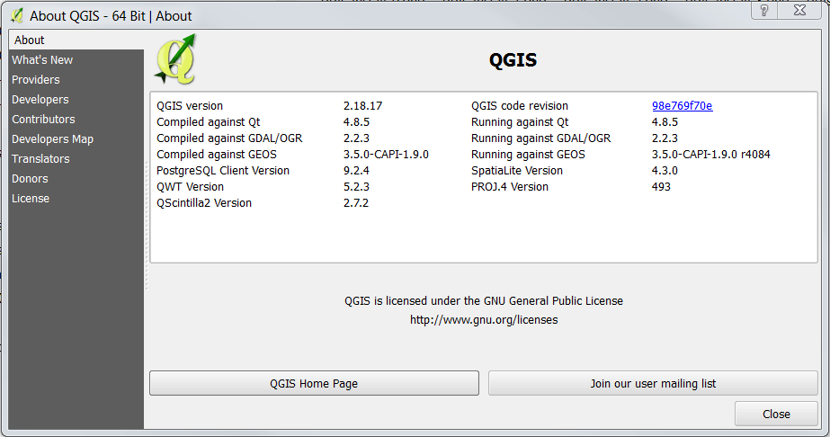

# Learn QGIS / Install QGIS #

Several versions of QGIS software are available for installation, depending on operating system and GIS component needs.
It is recommended that for general use one of the following versions is installed:

* OSGeo4 suite
	+ contains QGIS and other GIS software
	+ installs into `C:\OSGeo4W*`
* QGIS stand-alone version
	+ contains QGIS and other GIS software
	+ installs into `C:\Program Files\QGIS 3.4` (for example)

The OSGeo4W version is appropriate for more complex systems, such as where map servers are needed.
QGIS 3.x was released February 23, 2018.

The OSGeo4W stable long-term release (version 2.18.17 or later) can be installed with QGIS 3 if older QGIS 2 software is needed.
However, now that QGIS 3 has had time to be used and updated, QGIS 2 is less likely to be needed unless another
application depends on it.  This documentation focuses on the latest QGIS 3 version,
with sections for the OSGeo4W and standalone versions.

Use the following link to install download QGIS:

* [Download QGIS for your platform](http://www.qgis.org/en/site/forusers/download.html)

The detailed OSGeo4W installation below focuses on the ***Express Install***, which is sufficient for most users.
The ***Advanced Install*** section is also discussed because the Open Water Foundation
used the long-term release available in the advanced install during development of early
versions of the OWF GeoProcessor software.

The following sections are included in this documentation:

* [Download and Install QGIS for Cygwin](#download-and-install-qgis-for-cygwin)
* [Download and Install QGIS for Linux](#download-and-install-qgis-for-linux)
* [Download and Install OSGeo4W QGIS for Windows](#download-and-install-osgeo4w-qgis-for-windows)
	+ [Windows OSGeo4W Express Desktop Install](#windows-osgeo4w-express-desktop-install)
	+ [Windows OSGeo4W Advanced Install](#windows-osgeo4w-advanced-install)
	+ [Windows OSGeo4W Troubleshooting Install](#windows-osgeo4w-troubleshooting-install)
* [Download and Install Windows Standalone Installer](#download-and-install-windows-standalone-installer)
* [Run QGIS on Windows](#run-qgis-on-windows)
	+ [OSGeo4W QGIS 3](#osgeo4w-qgis-3)
	+ [OSGeo4W QGIS 2](#osgeo4w-qgis-2)
	+ [Standalone QGIS 3](#standalone-qgis-3)
* [Uninstall OSGeo4W QGIS](#uninstall-osgeo4w-qgis)
	+ [Backup Previous Install](#backup-previous-install)
	+ [Uninstall Manually](#uninstall-manually)
	+ [Uninstall Individual Packages](#uninstall-individual-packages)
* [Uninstall Standalone QGIS](#uninstall-standalone-qgis)
* [Next Steps](#next-steps)

--------------------

##  Download and Install QGIS for Cygwin ##

These instructions currently do not cover installing QGIS for Cygwin.
The best approach may be to install QGIS on Windows and then create shell scripts in Cygwin
to run the Windows version.

##  Download and Install QGIS for Linux ##

This section needs to be completed.

##  Download and Install OSGeo4W QGIS for Windows ##

**This version can be installed rather than or in addition to the Standalone QGIS installation.**

**These instructions were prepared for a Windows 10 64-bit computer, using the OSGeo4W QGIS 3.4.3 Madeira version.**

Before installing/updating QGIS:

* **If there are issues installing the software, try uninsalling the software and then installing again.**
* If updating QGIS, it is recommended to uninstall the previous version and unfortunately this may involve some manual steps.
See the [Uninstall QGIS](#uninstall-qgis) section.
* See the [Windows Troubleshooting Install](#windows-troubleshooting-install) section for more information about troubleshooting software once installed.

It is recommended to install the default "OSGeo4W" suite.
The ***OSGeo4W Network Installer*** provides defaults and the flexibility to install additional software components,
which may be needed, such as when working with map servers.
In this version, QGIS has been bundled into the OSGeo4W suite.
The ***QGIS Standalone Installer Version*** can also be installed for normal desktop GIS and provides QGIS and GRASS (raster processing) software.
The first of these options will result in files being installed in `C:\OSGeo4W64`,
whereas the second option will install into `C:\Program Files\...`.
Note that the [Open Water Foundation GeoProcessor software](http://learn.openwaterfoundation.org/owf-app-geoprocessor-python-doc-user/)
installation currently assumes the `C:\OSGeo4W64` installation.

The ***Express Install*** approach is recommended to install the latest software.
The ***Advanced Install*** approach can be used to install older versions of the software including QGIS 2.x long term release (old LTR);
however, this is typically only needed in specific cases and should be avoided if possible.
Downloading and installing QGIS will overwrite the previous version that is installed.
Installing multiple versions of QGIS is not described in this documentation but maybe be added in the future.

[Download and save the QGIS installer](http://www.qgis.org/en/site/forusers/download.html) for Windows,
selecting ***OsGeo4W Network Installer (64 bit)***, as shown below.

The installer file will have a name similar to `osgeo4w-setup-x86_64.exe` and is not specific to the QGIS version number.
The installer program can be run again later to update the software.
Therefore save in a location such as `C:\Users\user\Downloads\QGIS`.
If not saved, the installer can be downloaded again later.

**Run the installer with administrator privileges**.
The following dialog will be displayed asking how to install QGIS.

### Windows OSGeo4W Express Desktop Install ###

The ***Express Desktop Install*** is the simplest install and will install only the current QGIS 3+ version (no 2.x long term release).
Selecting the ***Express Web-GIS Install*** will default installation choices for components
such as the Open MapServer, which is not needed for desktop GIS tasks.
The installer can be run later to install web components if necessary. 
The following images illustrate the install process on a Windows 10 computer. 
The defaults were accepted unless otherwise noted.

Select ***Express Desktop Install*** on the inital setup window.

The following step selects the packages to download. 
[GDAL](http://www.gdal.org/) and [GRASS GIS](https://grass.osgeo.org/) software programs are commonly packaged libraries used within the QGIS software. 
It is highly recommended to use the default settings. 
If running the first time, you may be prompted to select a download server.

Agree to the terms of use for all components, similar to the following.

The install will begin.  It may take some time for the installation to complete given that a large number of packages are installed.

A message window appears once the installation is complete. 

After installation, the software is listed in the ***Start / QGIS3*** menu and the
***Start / OSGeo4W*** menu provides access to other GIS software.
The OSGeo4W version of QGIS is installed in the `C:\OSGeo4W64` folder.

Note that the above menus are different than the ***Start / QGIS 3.4*** menu,
which is created by the standalone QGIS installer.

### Windows OSGeo4W Advanced Install ###

The ***Advanced Install*** will install QGIS 3 and is required if it is necessary to run the older QGIS 2.x software, which used Python 2.
This following instructions are retained in this documentation for reference.
However, it is recommended to use the latest QGIS 3 installer described in the previous section if possible.
The following images illustrate the install process on a Windows 10 computer.
The defaults were accepted unless otherwise noted.

Select ***Advanced Install*** on the inital setup window.

The following step selects the installation folder.
Note that if a standalone installation is done rather than the OSGeo4W suite,
the installation folder will be `C:\Program Files\...`.
Installing for all users saves disk space because a single version of the software is installed.

For the following note that ***OSGeo4W*** will be shown in the ***Start*** menu after the software is installed.
Different versions of QGIS, such as the current 3.0.0 and stable long-term release 2.18.17 (or later)
will be listed under this menu.

For the following, use the default ***Direct Connection*** internet connection setting unless it is
known that another option is required.

For the following, it may be best to select a site that is physically closer.
However, the default can be used until there is a reason to change.
Downloads sites do sometimes go away.

The following allows selecting individual components.
The advanced install is being used to ensure that the long-term release is installed.
Therefore, make sure that the `qgis-ltr` component **does not** have `Skip` next to it.
If so, click on the item to toggle the setting so it will install.
Required dependencies will automatically be selected.
After the installer has been run at least once, the work `Keep` will be shown next to the item.
Other components can also be added if desired.

Clicking ***Next >*** in the above will install the selected components.
A progress indicator will be shown.
The following indicates a successful installation.
Press ***Finish*** to exit the installer.

One or more license acknowledgement requests may be displayed to
fulfill licensing requirements of component software.
The person installing the software just needs to acknowledge that the license notice was read.

### Windows OSGeo4W Troubleshooting Install ###

The following information may be helpful when troublehshooting a QGIS installation or update:

* **After update, scripts that run QGIS still find the old software**.  
If an update has occurred, the previous version may have been copied to a new folder.
For example `C:\OSGeo4W64` may have been copied to `C:\OSGeo4W64-old`.
The underlying scripts that run QGIS use old-style 8.3 filenames,
which results in using a folder name `C:\OSGEO4~1`.
Renaming the folder as shown above still matches the old convention.
Therefore, the old folder is found and is run.
To fix, rename the old installation to `C:\x-OSGeo4W64` or similar so that the filename is
different enough to change the old-style name.

## Download and Install Windows Standalone Installer ##

**This version can be installed rather than or in addition to the OSGeo4W QGIS installation.**

See the [QGIS download page](https://www.qgis.org/en/site/forusers/download.html)
for QGIS Standalone Installer version.
After downloading, run the installer as described below.

The QGIS standalone installer installs QGIS independent of the `C:\OSGeo4W64` installation,
resulting in the software being installed in `C:\Program Files\QGIS 3.4` (or similar) and
run from ***Start / ...***.
The standalone installation has fewer components than the OSGeo4W installation.
The following steps illustrate installation of QGIS 3.4.3 Madeira on Windows 10.

Press ***Next>*** to continue.  One or more license agreements may be displayed, as shown below.

Press ***I Agree*** to continue.

The default installation folder should be used.
Press ***Next >*** to continue.

The above datasets are distributed for testing and can be selected if desired.
Press ***Install*** to install the software.
The following image indicates where the data files are installed.
Note that there is an issue that if the QGIS installer is run as administrator,
the data files are installed under the administrator account rather than the normal user.

The following indicates a successful installation.

Press ***Finish*** to exit the installer.

## Run QGIS on Windows ##

### OSGeo4W QGIS 3 ###

QGIS 3.x is bundled with both Python 2.7+ and Python 3.6+ but uses Python 3.6+ for start-up and processing. 
QGIS can be started with the Windows ***Start*** menu or with the installed batch files. 

- To run QGIS with the Windows ***Start*** menu, use the ***OSGeo4W*** start menu shown below (example is for Windows 10 Pro). 
Click the `QGIS Desktop 3.X.X` option.  Newer versions of QGIS 3 may be available in the ***Start / QGIS3*** menu.
Note that if the long-term release QGIS version was installed with the [Advanced Install](#advanced-install) 
then `QGIS Desktop 2.X.X` will also be available in the ***OSGeo4W*** dropdown menu. 
See the [QGIS 2](#qgis-2) section for more details. 

	

- To  run QGIS with the batch file, double-click the `qgis.bat` file at `C:\OSGeo4W64\bin\qgis.bat`.
Note that if the long-term release QGIS version was installed with the [Advanced Install](#advanced-install)
then start QGIS 2 with the `qgis-ltr.bat` file at `C:\OSGeo4W64\bin\qgis-ltr.bat`. 
See the [QGIS 2](#qgis-2) section for more details. 

Running ***QGIS Desktop 3.0.3*** displays the user interface similar to below. 

The ***Help / About*** menu displays the software version information (see below),
which is useful when troubleshooting.

### OSGeo4W QGIS 2 ###

QGIS 2.x is bundled with Python 2.7+ and QGIS 3.x is bundled with Python 3.6+ to
ensure that Python integration performs as intended.
To run QGIS 2.x, an older installation may have been installed,
or QGIS 3.x is installed using the Advanced Install and also install the long term stable release,
[as described above](#advanced-install).
 
The Windows ***Start*** menu and batch files that run QGIS also indicate the version.
For example, the batch file `qgis.bat` runs the current version (e.g., 3.0.0) and
`qgis-ltr.bat` runs the long-term release (e.g., 2.18.17 or later).

To run QGIS use the ***OSGeo4W*** start menu shown below (example is for Windows 7).
Note that QGIS 3.0.0 is also available, and as updates are installed will become more and more stable
and ready for production use.

Running ***QGIS Desktop 2.18.17*** displays the user interface similar to below.

The ***Help / About*** menu displays the software version information (see below),
which is useful when troubleshooting.

### Standalone QGIS 3 ###

After installing, the software is installed in `C:\Program Files\QGIS 3.4`.
The ***Start / QGIS 3.4*** menu provides access to the specific version of QGIS
and related software.

Note that the ***Start / QGIS3*** menu is created by the OSGeo4W installer and will
point to software in the `C:\OSGeo4W64` folder.

## Uninstall OSGeo4W QGIS ##

It may be necessary to uninstall the OSGeo4W QGIS and then reinstall.
In fact, it is recommended to uninstall QGIS before installing an update.

According to the [OSGeo4W FAQ site](https://trac.osgeo.org/osgeo4w/wiki/FAQ#IsthereawayofuninstallingpackagesorallofOSGeo4W),
there is no way to cleanly install the OSGeo4W suite:

	Currently there is no installer option to uninstall OSGeo4W completely.
	However, when all OSGeo4W applications, shells and services (like apache) are shutdown
	it is possible to just delete the whole OSGeo4W file tree (usually C:\OSGeo4W).

See the [Stack Overflow article about uninstalling `OSGeo4W Network` version](https://gis.stackexchange.com/questions/189067/how-to-cleanly-upgrade-qgis-on-windows/253591).
Because the OSGeo4W suite installs multiple programs, using the Windows Uninstall feature does not work well.

### Backup Previous Install ###

The OSGeo4W install is complex and by default will overwrite the previous installation in the `C:\OSGeo4W64` folder.
If there is a need to save the old version before doing an uninstall, do the following,
or, alternatively, save to backup medium and then uninstall, as described in the following sections:

#### OSGeo4W version ####

* **Move the `C:\OSGeo4W64` folder to a new name.**
To avoid confusion with scripts that use 8.3 filenames, add something to the front of the folder name.
* **Copy the ***Start*** menu shortcuts.**
To remove menus, go to the ***Start / OSGeo4W64*** menu.  On any software menu, right-click and select ***More / Open File Location***.
This will open a ***File Explorer***  in a folder similar to `C:\ProgramData\Microsoft\Windows\Start Menu\Programs\OSGeo4W`.
Rename the folder to another name anywhere on the computer.
This will retain shortcuts found in the folder.

#### Standalone QGIS version ####

Need to add this section.

### Uninstall Manually ###

#### OSGeo4W version ####

A manual uninstall is optionally done rather than uninstall individual packages (next section), not both.

If the previous version is not uninstalled and then a new version is installed, the result may have the following traits:

* ***Start / OSGeo4W*** menu shows previous version and possibly menus ending with `(1)` or other number,
indicating a second copy of menu configuration files.
This is caused by the installer creating duplicate files in the ***Start*** menu shortcuts.
* Software files will include multiple versions.  For example, `Python36` and `Python37` (or other) versions of of
Python will be installed when only one version should be installed.

To manually remove the software, do the following:

* **Delete the `C:\OSGeo4W64` folder (or move to a new name).**
* **Remove the ***Start*** menu shortcuts.**
To remove menus, go to the ***Start / OSGeo4W64*** menu.  On any software menu, right-click and select ***More / Open File Location***.
This will open a ***File Explorer***  in a filder similar to `C:\ProgramData\Microsoft\Windows\Start Menu\Programs\OSGeo4W`.
If multiple versions of the OSGeo4W suite have been installed, the menu shortcut files may be duplicated.
Delete the shortcut files and then (re)install the OSGeo4W software suite.

#### Standalone version ####

Need to evaluate whether there are similar issues to the OSGeo4W update or perhaps the QGIS stand-alone installer
does a better job removing old versions of the software.

### Uninstall Individual Packages ###

A package uninstall is optionally done rather than manual uninstall (next section), not both.

It is possible to unistall individual packages using the software installer tool.
This involves deselecting packages in the `OSGeo4W` installer.
**However, doing so may require that the packages need to be reselected for istall in a future installation - need to confirm how "sticky" the selections are.**
It may make more sense to uninstall manually as described in the previous section.

[Download and save the QGIS installer](http://www.qgis.org/en/site/forusers/download.html) for Windows,
selecting ***OSGeo4W Network Installer (64 bit)***, as shown below.

Select ***Advanced Install*** on the inital setup window.

Click through all of the windows accepting the *defaults* until the ***Select Packages*** window is displayed.

Expand each ***Category*** by clicking the plus sign (`+`) next to each option. 

Find a package to uninstall. Under the ***New*** column, click on the version number to change it to ***Uninstall***. 
Repeat for all desired packages. 

To delete QGIS Desktop, expand the ***Desktop*** category and enable the ***Uninstall*** option next to the `qgis: QGIS Desktop` package.

## Uninstall Standalone QGIS ##

###  Uninstall Standalone QGIS on Windows ###

Need to fill out this section.
Because the standalone version of QGIS is self-contained within the `C:\Program Files\QGIS 3.4` (or similar) folder,
it can be removed using the normal Windows remove programs tools (is this true?).

## Next Steps ##

After installing QGIS it is possible to run QGIS to create a map and add layers to the map.
