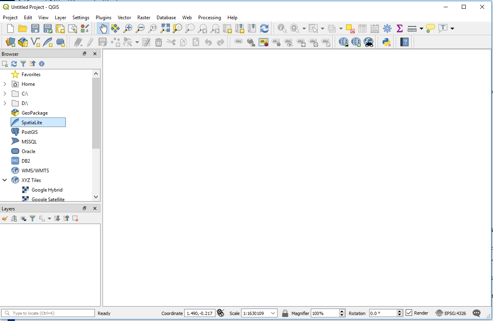

# QGIS / Map Configuration / Overview #

The ***QGIS Desktop*** software can be used to create maps containing multiple spatial data layers, legend, etc.
This documentation describes basic map configuration.  The following sections are available in this documentation:

* [Blank Map](#blank-map)
* [Save Project](#save-project)
* [Project Properties](#project-properties)
* [Add Spatial Data Layers](#add-spatial-data-layers)

------------------

## Blank Map ##

The ***QGIS Desktop*** software when opened displays a somewhat complicated interface with many tools at top and on the left,
and a large white blank panel, as shown below.  This is the blank map before any data layers are added.

**

QGIS Interface at Startup and for Blank Project (<a href="../images/qgis-blank.png">see full-size image</a>)

**

## Save Project ##

QGIS refers to the map as a "project" in software features, such as the ***Project*** menu.
This document uses the terms "project" and "QGIS project" to describe a QGIS project.

The QGIS project, when saved, creates an XML file with `.qgs` extension, which contains map properties and list of
layers that have been added to the map.  The project can be saved at any time using the ***Project / Save...*** menu,
where the project name is shown in the title bar.  The file will save to the last location that a project was saved,
which can be confusing.  To ensure saving to a desired location, use the ***Project / Save As...*** menu.

The project can be saved at any point to save incremental work, including the state of the map such
as selected layers and visible extent.
Use normal file version naming protocols to ensure that work is not lost.

## Project Properties ##

The map project has properties that control the coordinate reference system (CRS) and other information.
Use the ***Project / Project Properties...*** menu to view and edit project properties.

## Add Spatial Data Layers ##

Spatial data layers can be added using the tools on the left side of the interface.
Mouse over the tools to see the format that can be added by the tool.
The [Map Layers](../map-layers/overview.md) section of this documentation discusses map layers.
