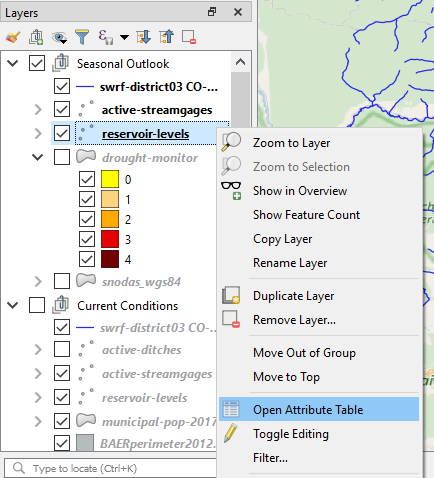
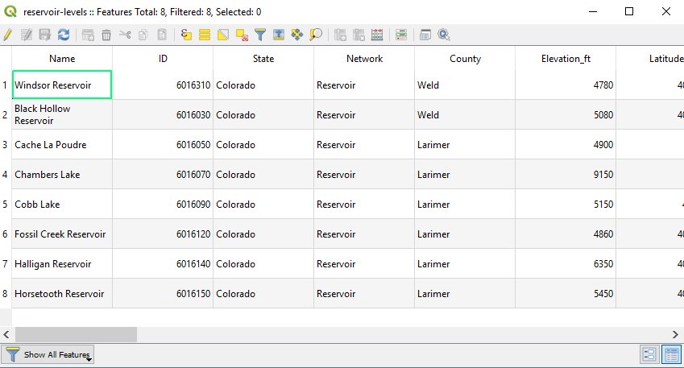

# Map Layers / Overview #

Map layers, also called spatial data layers, are spatial datasets that form the basis of GIS visualization and analysis.

The following sections are available in this documentation:

* [Spatial Data Layer Concepts](#spatial-data-layer-concepts)
* [Adding Layers to Map Project](#adding-layers-to-map-project)

-----------------

## Spatial Data Layer Concepts

A spatial data layer at a fundamental level can be either a [raster](https://en.wikipedia.org/wiki/Raster_graphics) or vector layer.

A raster layer is used to represent data somewhat uniformly, where each cell or "pixel" has a constant size and has a data value.
The raster "grid" typically represents some model space, such as a groundwater model, satellite imagery, or data array.
The corners of the raster can be anchored to locations given a coordinate reference system, to allow projecting the raster
to the display CRS. The "warping" of raster data layers onto projected representations of the earth is computationally intensive.
To facilitate visualization, especially on the web, background layers such as satellite imagery and street maps are provided
by web servers as tiled images using a standard CRS (such as Web Mercator).  Zooming into a map cases the needed tiles to
be returned for display.

A vector layer (or feature layer) consists of a list of geometric shapes, such as points, lines, polygons, or other shapes.
In many spatial data formats only one shape type can exist in a layer, although newer formats and databases allow mixing shape types.
The advantage of vector data is that shapes can be redrawn (rendered) at varying scale, although zooming in will
reveal the distance between points and curves will become jagged.  
Each shape also has attributes (also called properties), which are commonly described as an attribute table for all the shapes.
In QGIS, the attribute table can be displayed by selecting a layer in the ***Layers Panel***, right-clicking,
and selecting the ***Open Attribute Table*** menu, as shown below.

An example attribute table is shown in the following figure.

## Adding Layers to Map Project ##

Unfortunately, although concepts related to spatial data layers should transfer between different data formats,
the design of data layers files and databases introduces differences that must be handled in software.
This is why the QGIS software has multiple tools for adding spatial data layers.
The following documentation sections provide information for different layer formats:

* Vector spatial data formats:
	+ [GeoJSON](vector-geojson/) - text format open specification
