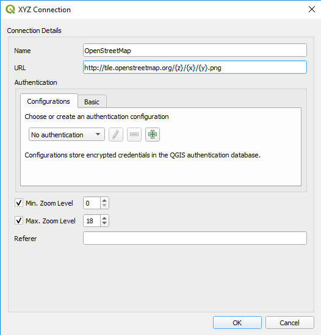
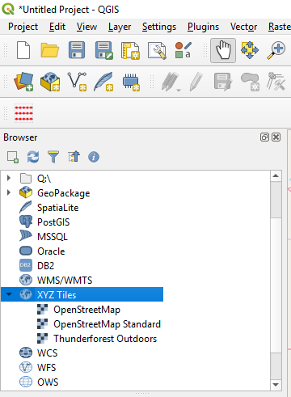
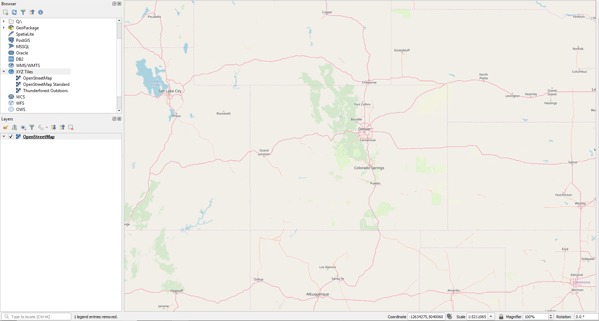
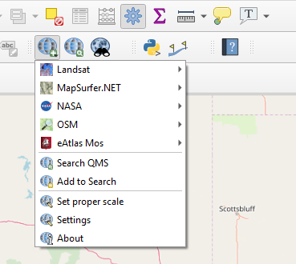

# QGIS / Tiled Background Layers #

Background layers, or basemaps, are the background images you see when viewing a map.  For example, the basemap may focus on city streets, 
show outdoor features such as rivers and mountains, or may contain satellite imagery.  Using a background layer provides more context 
for a project.

Map tiles have greatly altered the idea of web mapping and give fast access to large datasets.  Map tiles divide the world into small tiles, 
typically 256 x 256 pixels, for each zoom level and pre-render datasets to these tiles.  In this way, only a small fraction of the background 
map is served to a user at any given time.  This results in a map that can be easily zoomed or panned. 

There are a couple of ways to add background layers in QGIS: 
* [XYZ Tiles](#xyz-tiles)
* [QuickMapServices Plugin](#quickmapservices-plugin)

--------------

## XYZ Tiles

Basemaps can be added using XYZ Tiles.  To add a basemap, use the following method:

1. From the Browser pane on the left side of the screen, right-click on ***XYZ Tiles*** and select ***New Connection...***.
2. Type in the name of the map and enter its URL.  Some example URLs can be found in this [StackExchange question](https://gis.stackexchange.com/questions/20191/adding-basemaps-from-google-or-bing-in-qgis).

3. From the Browser pane on the left side of the screen, click on ***XYZ Tiles*** to display the dropdown menu.  The layer added in step 2 should now appear as an option to select.

4. Click and drag the layer onto the map canvas.
5. The background layer will appear on the map canvas and the layer name will now also appear in the Layers pane.

## QuickMapServices Plugin

The QuickMapServices Plugin provides a range of basemaps to add to a QGIS project.  First, the plugin must be installed using 
the following method:

1. Select the ***Plugins / Manage and Install Plugins...*** menu.
2. Under All Plugins, scroll through the list to find QuickMapServices, then click the "Install plugin" button.
3. Close the Plugins dialog box.

To access the QuickMapServices plugin, click on the plugin's icon on the ribbon:

A number of basemap options are available, such as Landsat and NASA.  Note that some layers require an API key.  OWF has not yet 
determined how to incorporate API keys into the use of basemaps.

## Resources

* [Adding Basemaps from Google or Bing in QGIS?](https://gis.stackexchange.com/questions/20191/adding-basemaps-from-google-or-bing-in-qgis)
* [This is How to Add Google Maps Layers in QGIS 3](https://www.geodose.com/2018/03/how-to-add-google-maps-layer-QGIS-3.html)
