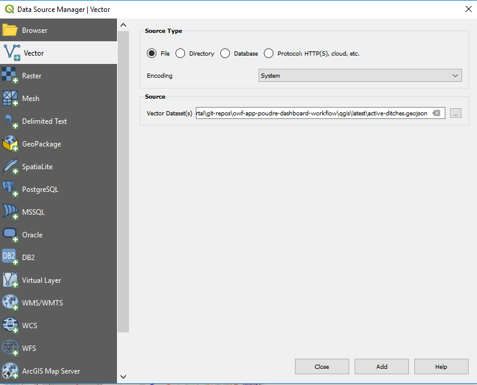
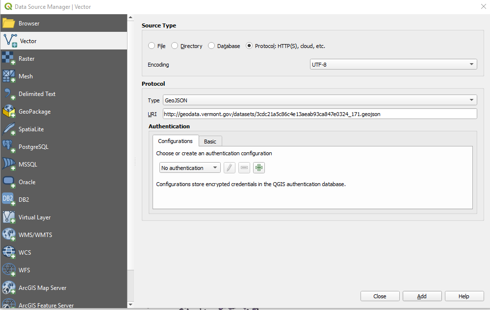

# QGIS / Map Layers / GeoJSON (vector) #

GeoJSON is an open specification for text representation of vector spatial data layer.
GeoJSON is a format that is generally easy to generate and read.
A major benefit is that it is a text format with the entire layer in one file (unlike shapefiles, for example).
GeoJSON files can easily be hosted on static websites and can be directly read by GIS tools.

See also the [Open Water Foundation / Learn GeoJSON](http://learn.openwaterfoundation.org/owf-learn-geojson/) documentation.

The following sections are included in this documentation:

* [GeoJSON Specification](#geojson-specification)
* [GeoJSON Limitations](#geojson-limitations)
* [Add GeoJson Layer to QGIS Map](#add-geojson-layer-to-qgis-map)
	+ [Add Layer Available as a Local File](#add-layer-available-as-a-local-file)
	+ [Add Layer Available on the Web](#add-layer-available-on-the-web)

--------------

## GeoJSON Specification

The following resources provide information about the GeoJSON specification:

* New specification (RFC 7946):
	+ [geojson.org](http://geojson.org/)
	+ [RFC 7946 for GeoJSON 2016](https://tools.ietf.org/html/rfc7946) - difficult to read
	+ [GeoJSON on Wikipedia](https://en.wikipedia.org/wiki/GeoJSON) - easy to read
* Original specification:
	+ [2008 GeoJSON specification](http://geojson.org/geojson-spec.html) - readable documentation for 2008 specification, generally still valid

## GeoJSON Limitations ##

GeoJSON is simple by design and consequently it has limitations, including:

* Comments are not allowed since the JSON format does not allow.  Properties can be used.
* There does not appear to be a metadata standard for GeoJSON.
Therefore it can be difficult to attribute the source of the data, for example.
* Because the format is text, files can be large.  Compression can be used if software can uncompress on the fly.
The number of digits used for geometry coordinates can be limited, as appropriate, if software allows.
* Serializing data into properties can pose challenges if the software does not know how to intelligently handle data objects.
* GeoJSON is purely a data representation.
Symbolization information is not included (in contrast to KML or shapefile packaged with layer file).

## Add GeoJSON Layer to QGIS Map ##

A GeoJSON file can be added as a vector layer in QGIS using one of the following approaches.

### Add Layer Available as a Local File ###

An easy way to add a GeoJSON file to a map is to use Windows File Explorer
to select and drag a GeoJSON file onto the map.
The following method can also be used.

1. Select the ***Layer / Add Layer / Add Vector Layer*** menu
2. Select the ***Source Type*** to be ***File***.
3. Use the ***Browse*** button to select the file.

Pressing ***Add*** will display the layer on the map and in the ***Layers*** panel
at which time layer properties can be edited if desired.

### Add Layer Available on the Web ###

1. Select the ***Layer / Add Layer / Add Vector Layer*** menu.
1. Select the ***Source Type*** to be ***Protocol***.
2. Select the ***Protocol*** to be ***GeoJSON***.
3. Specify the URI to a GeoJSON file:
	* web service URI that returns raw GeoJSON format
	* static website URI (for example: `http://geodata.vermont.gov/datasets/3cdc21a5c86c4e13aeab93ca847e0324_171.geojson`)

Pressing ***Add*** will display the layer on the map and in the ***Layers*** panel
at which time layer properties can be edited if desired.
